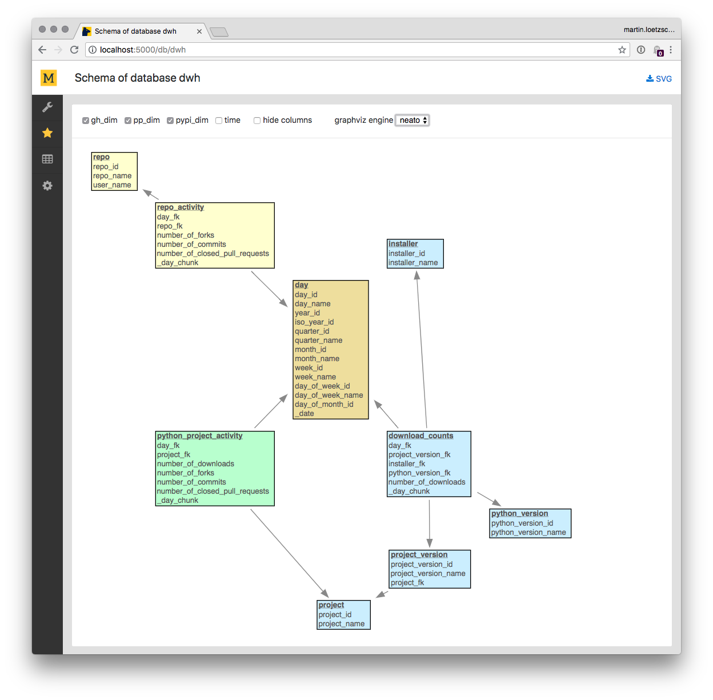
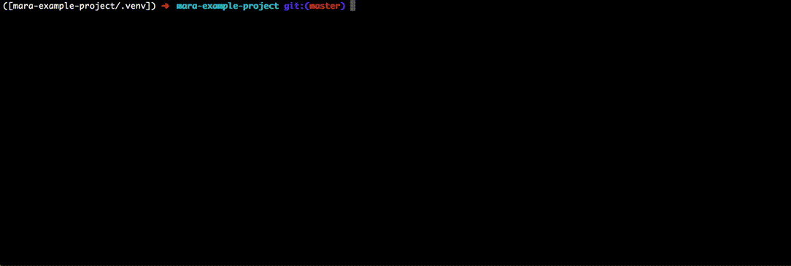
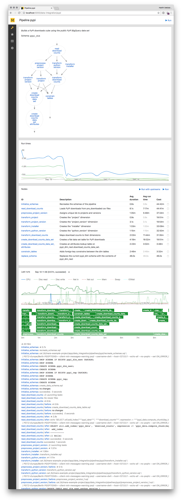
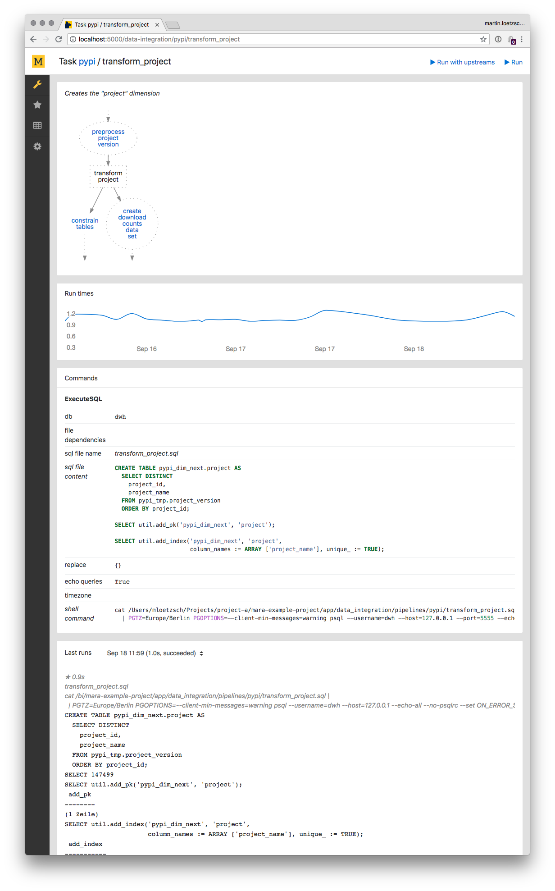

# Mara Example Project

A runnable app that demonstrates how to build a data warehouse with mara. Combines the [data-integration](https://github.com/mara/data-integration) and [bigquery-downloader](https://github.com/mara/bigquery-downloader) libraries with the [mara-app](https://github.com/mara/mara-app) framework into a project. 

The example ETL integrates PyPi download stats and GitHub repo activitiy metrics into more general Python project activity stats.

The repository is intended to serve as a template for new projects.

&nbsp;


## Example: Python Project Stats

The project uses two data sources: 

1. The [PyPI downloads](https://packaging.python.org/guides/analyzing-pypi-package-downloads/) BigQuery data set at [https://bigquery.cloud.google.com/dataset/the-psf:pypi](https://bigquery.cloud.google.com/dataset/the-psf:pypi) (Google login required). It contains each individual package download together with project and client attributes. 

2. The [Github archive](https://www.gharchive.org/) BigQuery data set at [https://bigquery.cloud.google.com/dataset/githubarchive:day](https://bigquery.cloud.google.com/dataset/githubarchive:day). It contains nearly all events that happen to Github repositories.

From both data sources, a set of pre-aggregated and filtered CSVs is incrementally downloaded using the queries in [app/bigquery_downloader](app/biqquery_downloader):

```console
$ gunzip --decompress --stdout data/2018/04/10/pypi/downloads-v1.csv.gz | grep "\tflask\t\|day_id" | head -n 11
day_id	project	project_version	python_version	installer	number_of_downloads
20180410	flask	0.1		bandersnatch	1
20180410	flask	0.2		bandersnatch	1
20180410	flask	0.5		bandersnatch	1
20180410	flask	0.6		bandersnatch	1
20180410	flask	0.8		bandersnatch	1
20180410	flask	0.9		bandersnatch	1
20180410	flask	0.10	2.6	pip	1
20180410	flask	0.11		Browser	1
20180410	flask	0.11		bandersnatch	1
20180410	flask	0.5.1		bandersnatch	1
```

```console
$ gunzip --decompress --stdout data/2018/04/10/github/repo-activity-v1.csv.gz | grep "\tflask\t\|day_id"
day_id	user	repository	number_of_forks	number_of_commits	number_of_closed_pull_requests
20180410	liks79	flask	1		
20180410	dengyifan	flask		1	
20180410	xeriok18600	flask		1	
20180410	manhhomienbienthuy	flask		10
20180410	davidism	flask		49	
20180410	pallets	flask	10	6	3
```

The total size of these (compressed) csv files is 3.5GB for the time range from Jan 2017 to April 2018.

&nbsp;

Then there is the ETL in [app/data_integration/pipelines](app/data_integration/pipelines) that transforms this data into a classic Kimball-like [star schema](https://en.wikipedia.org/wiki/Star_schema):



It shows 4 database schemas, each created by a different pipeline: 

- `time`: All days from the beginning of data processing until yesterday,
- `pypi_dim`: PyPI download counts per project version, installer and day,
- `gh_dim`: The number of commits, forks and closed pull requests per Github repository and day,
- `pp_dim`: PyPI and Github metrics merged by day and repository/ project name.

The overall database size of the data warehouse is roughly 100GB for the timerange mentioned above. 

&nbsp;

With this structure in place, it is then possible to run queries like this:

```sql
SELECT 
  _date, project_name, number_of_downloads, number_of_forks, 
  number_of_commits, number_of_closed_pull_requests 
FROM pp_dim.python_project_activity 
  JOIN pypi_dim.project ON project_id = project_fk 
  JOIN time.day ON day_fk = day_id 
WHERE project_name = 'flask' 
ORDER BY day_fk DESC 
LIMIT 10;
```

```
   _date    | project_name | number_of_downloads | number_of_forks | number_of_commits | number_of_closed_pull_requests 
------------+--------------+---------------------+-----------------+-------------------+--------------------------------
 2018-04-10 | flask        |               45104 |              11 |                67 |                              3
 2018-04-09 | flask        |               57177 |              13 |                45 |                              4
 2018-04-08 | flask        |               70392 |              13 |                 7 |                               
 2018-04-07 | flask        |               65060 |              10 |                 7 |                               
 2018-04-06 | flask        |               70779 |               7 |                11 |                              2
 2018-04-05 | flask        |               62215 |               6 |                22 |                               
 2018-04-04 | flask        |               33116 |              11 |                23 |                               
 2018-04-03 | flask        |               39248 |              15 |                27 |                               
 2018-04-02 | flask        |               54517 |              14 |                17 |                               
 2018-04-01 | flask        |               68685 |               4 |                 6 |                               
(10 rows)
```

&nbsp;

Mara data integration pipelines are visualized and debugged though a web ui. Here, the pipeline `github` is run (locally on an old Mac with 2 days of data): 


&nbsp;

On production, pipelines are run through a cli interface:



&nbsp;

Mara ETL pipelines are compeletely transparent, both to stakeholders in terms of applied business logic and to data engineers in terms of runtime behavior.

This is the page in the web ui that visualizes the pipeline `pypi`: 



It shows 

- a graph of all pipeline children with dependencies between them,
- run times of the pipeline and top child nodes over time,
- a list of all child nodes with their average run time and cost,
- system statistics, a timeline and output of the last runs.

&nbsp;

Similarly, this the page for the task `pypi/transform_project`:



It shows its

- direct upstreams and downstreams,
- run times over time,
- all commands of the task,
- system statistics, a timeline and output of the last runs. 

&nbsp;

## Getting started

### Sytem requirements

Python >=3.6 and PostgreSQL >=10 and some smaller packages are required to run the example (and mara in general). 

Mac:

```console
$ brew install -v python3
$ brew install -v dialog
$ brew install -v coreutils
$ brew install -v graphviz
```

Ubuntu 16.04:

```console
$ sudo apt install git dialog coreutils graphviz python3 python3-dev python3-venv
```

&nbsp;

Mara does not run Windows.

&nbsp;

On Mac, install Postgresql with `brew install -v postgresql`. On Ubuntu, follow  [these instructions](https://www.postgresql.org/download/linux/ubuntu/). Also, install the [cstore_fdw](https://github.com/citusdata/cstore_fdw) and [postgresql-hll](https://github.com/citusdata/postgresql-hll) extensions from source.

To optimize PostgreSQL for ETL workloads, update your postgresql.conf along [this example](docs/postgresql.conf).

Start a database client with `sudo -u postgres psql postgres` and then create a user with `CREATE ROLE root SUPERUSER LOGIN;` (you can use any other name).

&nbsp;

### Installation

Clone the repository somewhere. Copy the file [`app/local_setup.py.example`](app/local_setup.py.example) to `app/local_setup.py` and adapt to your machine.

Log into PostgreSQL with `psql -u root postgres` and create two databases:

```sql
CREATE DATABASE example_project_dwh;
CREATE DATABASE example_project_mara;
```

Hit `make` in the root directory of the project. This will 

- create a virtual environment in `.venv`,
- install all packages from [`requirements.txt.freeze`](requirements.txt.freeze) (if you want to create a new `requirements.txt.freeze` from [`requirements.txt`](requirements.txt), then run `make update-packages`),
- create a number of tables that are needed for running mara.

You can now activate the virtual environment with 

```console
$ source .venv/bin/activate
```

To list all available flask cli commands, run `flask` without parameters.

### Docker

Requirements: `docker`, `docker-compose`

- Building the Postgres and the Mara images:

```console
$ make docker-build-postgres
$ make docker-build-mara
```

This will create the `mara-postgres:dev` and the `mara-app:dev` images.

- Adapt the container's db-host at the `databases()` function in your `app/local_setup.py` as 'mara-postgres' instead of 'localhost' as in the code below:

```python
...

@patch(mara_db.config.databases)
def databases():
    db_host = 'mara-postgres'
    ...
...
```

This will
(a) expose a postgres instance at port 5432, 
(b) "make" the project (as described in the Installation part above), 
(c) expose the flask application at port 5000

- Create and start the containers:

```console
$ docker-compose up
```

- In order to gain access in one of the running containers, run:

```console
# For the mara-app container
$ docker exec -it mara-app bash

# For the mara-postgres container
$ docker exec -it mara-postgres bash
```

&nbsp;

### Running the web UI

```console
$ flask run --with-threads --reload --eager-loading
```

The app is now accessible at [http://localhost:5000](http://localhost:5000).

&nbsp;

### Downloading PyPI and Github data from BigQuery

This step takes many hours to complete. If you don't have time for this (or don't want to go through the hassle of creating Google Cloud credentials), we provide a daily updated copy of the result data sets on s3. You can get (and update) the set of result CSVs with 

```console
$ make sync-bigquery-csv-data-sets-from-s3
```

&nbsp;

To download the data yourself, follow the instructions in the README of the [mara/bigquery-downloader](https://github.com/mara/bigquery-downloader) package to get a Google Cloud credentials file. Store it in `app/bigquery_downloader/bigquery-credentials.json`. 

Then run the downloader in an activated virtual environment with:

```
$ flask bigquery_downloader.download_data
```

&nbsp;

### Running the ETL

For development, it is recommended to run the ETL from the web UI (see above). On production, use `flask data_integration.ui.run` to run a pipeline or a set of its child nodes. 

The command `data_integration.ui.run_interactively` provides an ncurses-based menu for selecting and running pipelines.

&nbsp;

## Documentation

Documentation is work in progress. But the code base is quite small and documented.